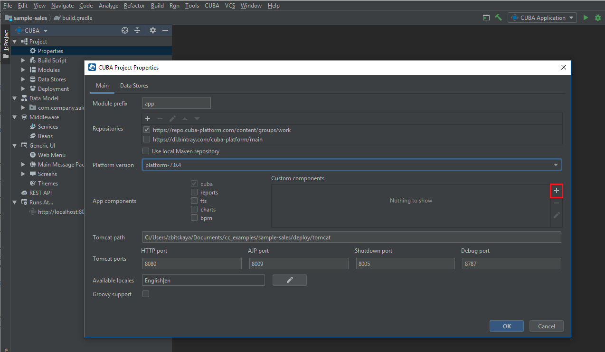

<p>
    <a href="http://www.apache.org/licenses/LICENSE-2.0"></a>
    <a href="https://travis-ci.org/cuba-platform/multitenancy-addon"></a>
</p>

# Overview

The component implements a single database multi-tenancy support for CUBA applications.

It enables using a single application instance to serve multiple tenants - groups of users that are invisible to each other and do not share any data they have write access to.

The component supports two types of data:
* common data - shared across tenants. Tenants have read-only  access to this type of data;
* tenant-specific data - not accessible to other tenants. Tenants have full access to this type of data.

All tenants have their own admin users which can create tenant users and assign tenant-specific roles and permissions.

<!--This is a single database/single schema implementation of multi-tenancy. Tenant-specific data owner is specified by the means of column `TENANT_ID` in tenant tables.-->

<!--All tenant-specific entities implement `HasTenant` interface, which simply states that an entity should have getter and setter for tenant id attribute.-->

See [sample application](https://github.com/cuba-platform/multitenancy-addon-demo), using this component.

# Installation

1. Open your application in CUBA Studio.

2. Edit *Project properties*.

3. Click the *Plus* button in the *App components* section of the *Main* tab.

    

4. Specify the coordinates of the component in the corresponding field as follows: group:name:version.

   

   * Artifact group: *com.haulmont.addon.sdbmt*
   * Artifact name: *sdbmt-global*
   * Version: *add-on version*

  When specifying the component version, you should select the one, which is compatible with the platform version used in your project.

| Platform Version  | Component Version |
|-------------------|-------------------|
| 7.1.x             | 1.4.0             |
| 7.0.x             | 1.3.2             |
| 6.10.x            | 1.2.1             |
| 6.9.x             | 1.1.1             |
| 6.8.x             | 1.0.0             |

5. Click *OK* to confirm the operation.

# Setting

Tenant-specific tables must have additional column `TENANT_ID` to specify the owner of data.
Note that `Group`, `User`, `UserSessionEntity` standard CUBA entities are already extended in the component and have `TENANT_ID` column.
If you want to use your own classes please extend your classes from `TenantGroup`, `TenantUser`, `TenantUserSessionEntity`.

Use one of the following two ways to make your entities tenant-specific:

1. Extent `StandardTenantEntity` instead of the `StandardEntity` (`StandardTenantEntity` basically is CUBA `StandardEntity` but with `TENANT_ID` column).

2. Implement `HasTenant` interface and add `TENANT_ID` column manually.

**Note**. Tenants don't have write access to entities without the `tenantId` attribute. It is also true for CUBA system entities.

## CUBA system tenant-specific entities

Some of CUBA system entities are important for proper user experience: roles and permissions, filters on screens, files in the file storage, emails, search folders.
You can make them tenant-specific simply by extending the entity and implementing `HasTenant` interface in child classes.

The following examples show how to make it:

* **Security roles and permissions**: an ability for tenants to create their own roles and permissions. It is not required but it gives an ability for tenants to have a hierarchy of users, having different access to the system

 Extend the following CUBA entities and make them implementing `HasTenant` interface:
 ```java
com.haulmont.cuba.security.entity.Role
com.haulmont.cuba.security.entity.UserRole
com.haulmont.cuba.security.entity.Permission
com.haulmont.cuba.security.entity.Constraint
com.haulmont.cuba.security.entity.GroupHierarchy
```
* **CUBA Filters**: an ability for tenants to create screen filters  

 Extend the following CUBA entity and make it implementing `HasTenant` interface:

 ```java
 com.haulmont.cuba.security.entity.FilterEntity
```

* **Application folders and Search folders**

 Extend the following CUBA entities and make them implementing `HasTenant` interface:
```java
com.haulmont.cuba.security.entity.SearchFolder
com.haulmont.cuba.security.entity.AppFolder
```

* **User sessions**: an ability for tenants to see the list of logged in users and their sessions

 Extend the following CUBA entitity and make it implementing `HasTenant` interface:
```java
com.haulmont.cuba.security.entity.UserSessionEntity
```
Note that this is a non-persistent entity, so the definition of `TenantId` entity will have `@MetaProperty` annotation instead of `@Column`:

 ```java
 @TenantId
 @MetaProperty
 protected String tenantId;
 ```

 Add the following line into `spring.xml`:
 ```xml
 <bean id="cuba_UserSessions" class="com.haulmont.addon.sdbmt.security.app.SdbmtUserSessions"/>
 ```

* **Dynamic Attributes**: an ability for tenant admins to add dynamic attributes to tenant-specific entities

 Extend the following CUBA entities and make them implementing `HasTenant` interface:
 ```java
 com.haulmont.cuba.core.entity.Category
 com.haulmont.cuba.core.entity.CategoryAttribute
 com.haulmont.cuba.core.entity.CategoryAttributeValue
 ```

 Add the following line into `web-spring.xml`:
 ```xml
 <bean id="cuba_DynamicAttributesGuiTools" class="com.haulmont.addon.sdbmt.gui.dynamicattributes.MultiTenancyDynamicAttributesGuiTools"/>
 ```


# Managing tenants

To manage tenants go to *Tenant management -> Tenants* screen.

Tenants are created and managed by global admins - users that don't belong to any tenant.  

Each tenant must have unique *Tenant Id*, *Root Access Group* and default administrator assigned.

Tenant access group serves the role of a root access group for tenant admins. Think **Company** access group, but for tenants.  
Tenant root access group can't be a parent of any other tenant's group, that is **sub-tenants are not supported**.

Creating tenants use tenant admin access group which is the same as *Root Access Group*. In the next versions of the add-on this preconditions will be set automatically.

# Tenant permissions

Tenant permissions are handled by CUBA security subsystem. Tenant permissions are compiled at runtime during user login and being stored in the user session. For implementation see `LoginEventListener` and `MultiTenancySecurityHandler`.

All tenants are implicitly assigned with a *Tenant Default Role*. The purpose of the role is to hide system functionality which must not be accessible to other tenants (JMX console, Server log and so on).

Default tenant role is specified in `TenantConfig` (`cubasdbmt.defaultTenantRole`). It is assigned to all tenant users automatically in `SdbmtUserEntityListener`.

Tenants can create their own user roles, so role editor has been modified. Additionally to CUBA requirement for users to have access to Permission entity, the system now allows the user to give only those permissions which he owns himself.  

Meaning if the user has read-only access to some entity, he can't permit other users to modify it, however, he can prohibit users from reading it.  
**Specific** and **UI** permissions have been hidden from tenants.

# Common and Tenant-specific data

## Common Data

Tenants have read-only access to all persistent entities that don't implement the `HasTenant` interface.  
This is implemented via Cuba security subsystem and compiled at runtime.

## Tenant-specific Data

All tenant-specific tables have additional column `TENANT_ID` to specify the owner of data.

To be tenant-specific an entity must implement the `HasTenant` interface.  
To make CUBA entity tenant-specific a developer should extend it in the project and make it implementing `HasTenant` interface. SQL update scripts can be generated either by CUBA Studio or manually.

Every time a tenant user reads tenant-specific data, the system adds an additional **where** condition on `TENANT_ID` to JPQL query in order to read the data of the current tenant only. Data with no `TENANT_ID` or with different `TENANT_ID` will be omitted.

**There is no automatic filtering for native SQL so tenants should not have access to any functionality giving access to write native SQL or Groovy code (JMX Console, SQL/Groovy bands in reports etc.)**.

There is no need to assign `tenantId` to entities manually - it is being handled automatically.  
During login, tenant user session receives `tenantId` from the tenant entity. Whenever a tenant user creates a tenant-specific entity system assigns `tenantId` to the newly created entity automatically. For implementation see `MtTransactionListener`.

A developer can add the `tenantId` attribute to tenant-specific entities screens, which can be useful for QA and for global administrators.  
`TENANT_ID` column/field will be hidden from tenant users as long as the `tenantId` attribute is marked with the `@TenantId` annotation in the entity code.
